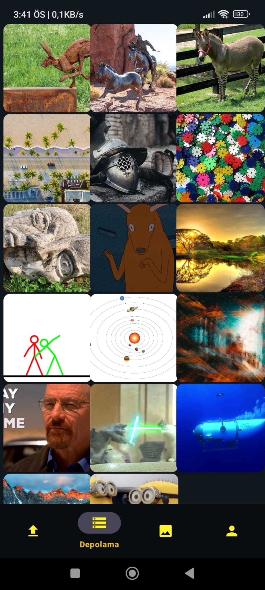

🌠Dil Değiştirme: 
🇹🇷 Türkçe için, [buraya](README_TR.md) tıklayın.  

📸 MasterPhotos  
&nbsp;&nbsp;&nbsp;MasterPhotos is an Android application that allows users to upload, store, view, and manage their photos securely using Firebase Storage.  

🚀 Features 
&nbsp;&nbsp;&nbsp;📸 Upload Photos: Users can select and upload photos from their device. 
&nbsp;&nbsp;&nbsp;🖼️ View Photos: Displays uploaded images with a full-screen preview option. 
&nbsp;&nbsp;&nbsp;⌠Delete Photos: Users can delete stored images. 
&nbsp;&nbsp;&nbsp;📥 Download Photos: Ability to download images to local storage. 
&nbsp;&nbsp;&nbsp;🔠Photo Details: Shows metadata such as file size and upload date. 
&nbsp;&nbsp;&nbsp;📦 Storage Limit: Prevents exceeding the 20MB storage limit per user. 
&nbsp;&nbsp;&nbsp;🌠Multi-language Support: Available in Turkish, English, Japanese, and Russian.  

🛠️ Technologies Used 
&nbsp;&nbsp;&nbsp;&nbsp;- Java (for Android development) 
&nbsp;&nbsp;&nbsp;&nbsp;- Firebase Storage (for cloud storage) 
&nbsp;&nbsp;&nbsp;&nbsp;- Firebase Authentication (for user authentication) 
&nbsp;&nbsp;&nbsp;&nbsp;- Glide (for efficient image loading)  
    
📥 Installation 
&nbsp;&nbsp;&nbsp;1. Clone the repository: 
&nbsp;&nbsp;&nbsp;&nbsp;&nbsp;&nbsp;- Copy Edit git clone https://github.com/your-username/MasterPhotos.git 
&nbsp;&nbsp;&nbsp;2. Open the project in Android Studio. 
&nbsp;&nbsp;&nbsp;3. Configure Firebase: 
&nbsp;&nbsp;&nbsp;&nbsp;&nbsp;&nbsp;- Add your google-services.json file. 
&nbsp;&nbsp;&nbsp;&nbsp;&nbsp;&nbsp;- Enable Firebase Storage and Authentication. 
&nbsp;&nbsp;&nbsp;4. Build and run the app on your Android device.  
    
📸 Screenshots  
 
 
 
 
 
 
 
 
  

📌 License 
This project is licensed under the MIT License.  

