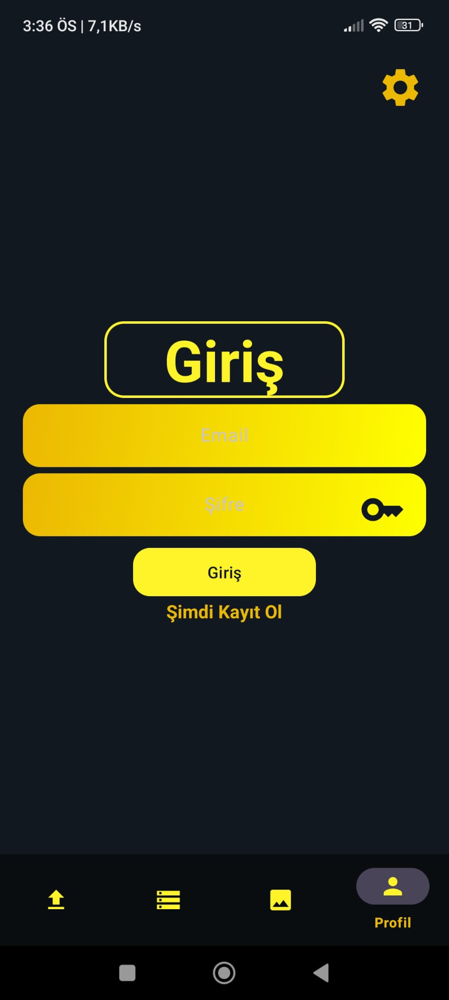
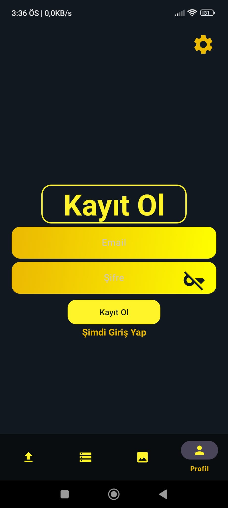
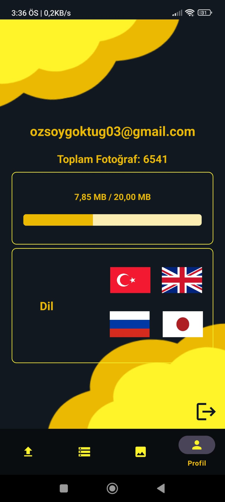
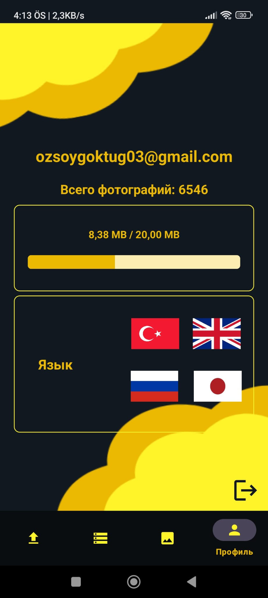
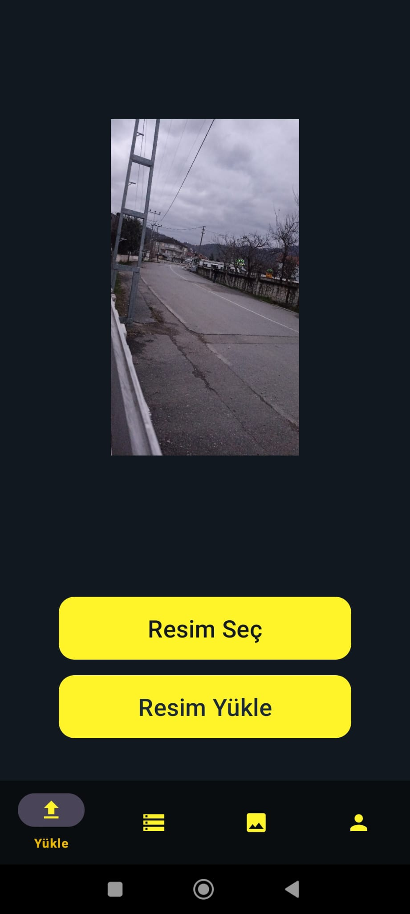
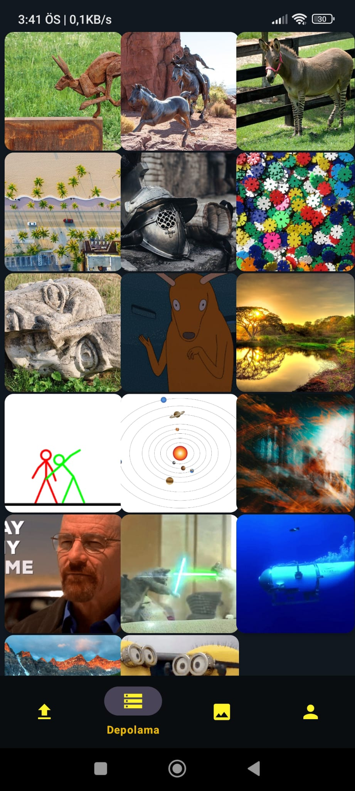

🌍 Switch Language: 
🇹🇷 For English, click [here](README.md)  

📸 MasterPhotos  
&nbsp;&nbsp;&nbsp;MasterPhotos, Firebase ile entegre çalışan bir Android galeri uygulamasıdır. Kullanıcıların fotoğraflarını yüklemelerine, görüntülemelerine, silmelerine ve indirmelerine olanak tanır.  

🚀 Özellikler 
&nbsp;&nbsp;&nbsp;📸 Fotoğraf Yükleme: Kullanıcılar cihazlarından fotoğraf seçerek Firebase Storage’a yükleyebilir. 
&nbsp;&nbsp;&nbsp;🖼️ Tam Ekran Görüntüleme: Fotoğraflar tam ekran modunda görüntülenebilir. 
&nbsp;&nbsp;&nbsp;❌ Fotoğraf Silme: Kullanıcılar yükledikleri fotoğrafları silebilir. 
&nbsp;&nbsp;&nbsp;📥 Fotoğraf İndirme: Kullanıcılar fotoğrafları cihazlarına indirebilir. 
&nbsp;&nbsp;&nbsp;🔍 Fotoğraf Detayları: Dosya boyutu ve oluşturulma tarihi gibi bilgileri görüntüleyebilirsiniz. 
&nbsp;&nbsp;&nbsp;📦 Depolama Sınırı: Kullanıcı başına 20 MB depolama sınırının aşılmasını engeller. 
&nbsp;&nbsp;&nbsp;🌍 Çoklu Dil Desteği: Uygulama Türkçe, İngilizce, Japonca ve Rusça dillerini destekler.  

🛠️ Kullanılan Teknolojiler 
&nbsp;&nbsp;&nbsp;&nbsp;- Java (Android geliştirme için) 
&nbsp;&nbsp;&nbsp;&nbsp;- Firebase Storage (Fotoğraf depolama) 
&nbsp;&nbsp;&nbsp;&nbsp;- Firebase Authentication (Kullanıcı kimlik doğrulama) 
&nbsp;&nbsp;&nbsp;&nbsp;- Glide (Görsellerin hızlı yüklenmesi için)  
    
📥 Kurulum 
&nbsp;&nbsp;&nbsp;1. Projeyi klonlayın: 
&nbsp;&nbsp;&nbsp;&nbsp;&nbsp;&nbsp;- Copy Edit git clone https://github.com/your-username/MasterPhotos.git 
&nbsp;&nbsp;&nbsp;2. Android Studio ile açın. 
&nbsp;&nbsp;&nbsp;3. Firebase yapılandırmasını tamamlayın: 
&nbsp;&nbsp;&nbsp;&nbsp;&nbsp;&nbsp;- google-services.json dosyasını indirin. 
&nbsp;&nbsp;&nbsp;&nbsp;&nbsp;&nbsp;- Firebase Depolama ve Kimlik Doğrulamasını Etkinleştirin. 
&nbsp;&nbsp;&nbsp;4. Uygulamayı çalıştırın.   
    
📸 Ekran Fotoğrafları  
 
 
 
 
 
 
 
 
  

📌 Lisans 
Bu proje MIT Lisansı ile lisanslanmıştır.  

